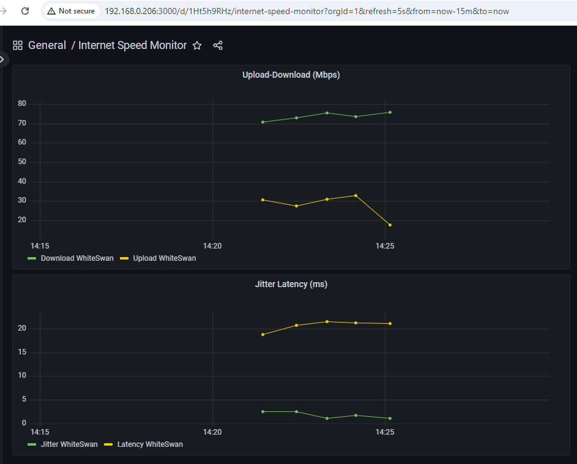

# Getting started
This example project demonstrates how to monitor internet speed in Raspberry Pi
and send the collected data to InfluxDB for visualization in Grafana.
The setup includes a python script, InfluxDB and Grafana, all are running in docker containers.

## Hardware requirements
Raspberry Pi(Raspberry Pi 4B was used for development) 

## Additional configuration in Pi
    * Set a static IP address to ensure the device is reachable over a known IP on the local network.
    * Docker, Docker-Compose should be installed 

## Ports
    * InfluxDB: 8086
    * Grafana: 3000

## Development environment 
Setup development environment by running InfluxDB and Grafana in docker containers by 
using the following command:
`docker compose -f docker-compose-dev.yaml up -d`

Environment variables are defined in the ./config/*.env files.
Start working with files in `src` directory

## Continuous internet speed monitoring 
To enable continuous monitoring, run the following docker compose command:
`docker compose -f docker-compose.yaml up -d`
The environment variables are defined in the ./config/*.env files.

## Dashboard overview
Once InfluxDB is configured as the datasource in Grafana, a dashboard should be created to display the relevant fields.

# Acknowledgments
Inspiration, code snippets
    https://pimylifeup.com/raspberry-pi-internet-speed-monitor/  
    https://pimylifeup.com/raspberry-pi-docker/

